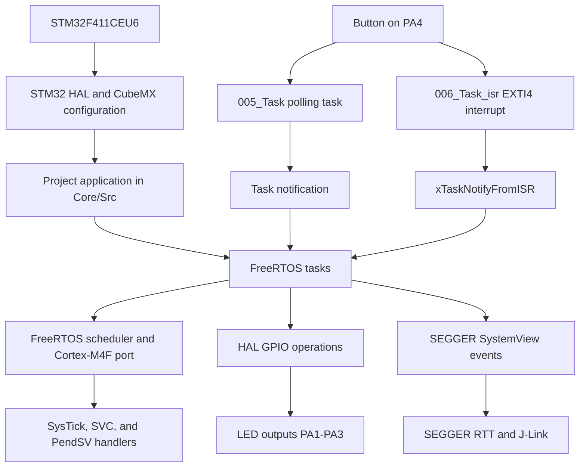

# STM32 FreeRTOS Examples

FreeRTOS learning projects for the STM32F411CEU6 Black Pill board. Each numbered
folder is a separate STM32CubeIDE project using the STM32 HAL. The examples
progress from basic task scheduling to button-driven task notifications and
interrupt-to-task communication.

## Projects

| Project | Example |
| --- | --- |
| `001_Task` | Creates three LED tasks and records events with SEGGER SystemView. The tasks toggle their LEDs using `HAL_Delay`. |
| `003_TASK` | Runs three LED tasks using `vTaskDelay` to block between toggles. |
| `004_Task` | Runs three periodic LED tasks using `vTaskDelayUntil`. |
| `005_Task` | Polls a button on PA4 in a task and uses task notifications to move through the LED tasks. |
| `006_Task_isr` | Uses the PA4/EXTI4 button interrupt to notify LED tasks with `xTaskNotifyFromISR`. |

The LED examples use GPIO outputs on PA1, PA2, and PA3. The button examples
use PA4. Check each project's `.ioc` file and `Core/Inc/main.h` for its exact
pin configuration.

## Architecture

Each numbered project has its own CubeIDE configuration, FreeRTOS configuration,
application, and build settings. The HAL initializes the MCU and peripherals;
FreeRTOS schedules the application tasks using the Cortex-M4F port. Tasks use
HAL GPIO calls for the LEDs and FreeRTOS delay or notification APIs to coordinate
their work. In `006_Task_isr`, EXTI4 calls the button handler, which uses the
ISR-safe notification API to wake the selected task.

## FreeRTOS and SystemView Integration

- FreeRTOS kernel and Cortex-M port sources are kept under
  `common/ThirdParty/FreeRtos/`; SEGGER SystemView and RTT sources are under
  `common/ThirdParty/SEGGER/`.
- Each project supplies its own `FreeRTOSConfig.h`. The configuration enables
  preemptive scheduling and maps the Cortex-M SVC, PendSV, and SysTick handlers
  to the FreeRTOS port. The tick rate and interrupt-priority rules are defined
  there; check the individual project configuration when comparing examples.
- Application startup initializes HAL and configured peripherals, initializes
  SEGGER SystemView, creates tasks with `xTaskCreate`, and starts the scheduler
  with `vTaskStartScheduler`.
- The examples use SystemView calls to record task activity. The trace setup
  uses SEGGER RTT with J-Link; DWT cycle counting supplies event timestamps.
  See [SYSTEMVIEW_SETUP.md](SYSTEMVIEW_SETUP.md) for the detailed setup and
  troubleshooting notes.

## Repository Layout

- `001_Task/`, `003_TASK/`, `004_Task/`, `005_Task/`, and `006_Task_isr/` contain
  the CubeIDE projects, application source, configuration, and linker scripts.
- `common/ThirdParty/` contains shared FreeRTOS and SEGGER sources used by the
  examples. Keep this folder when cloning the repository.
- `Records/` contains SEGGER SystemView recordings.
- `SYSTEMVIEW_SETUP.md` contains additional SystemView integration notes.
- `STM32_Programming/` contains additional FreeRTOS experiments and workspaces.

## Build

1. Install STM32CubeIDE and the STM32CubeF4 support package.
2. Clone the repository, keeping its folder structure intact so project-relative
  references to shared sources continue to work.
3. In STM32CubeIDE, import the desired task folder as an existing project.
   Each numbered folder is built and flashed independently.
4. Select the connected STM32F411 board, build the project, and flash it using
   the debugger/programmer configured for your setup.

Generated `Debug` and `Release` build output is not required in source control.

## Notes

The projects include STM32 HAL, FreeRTOS, and SEGGER components. Refer to the
license files distributed with those components for their respective terms.
